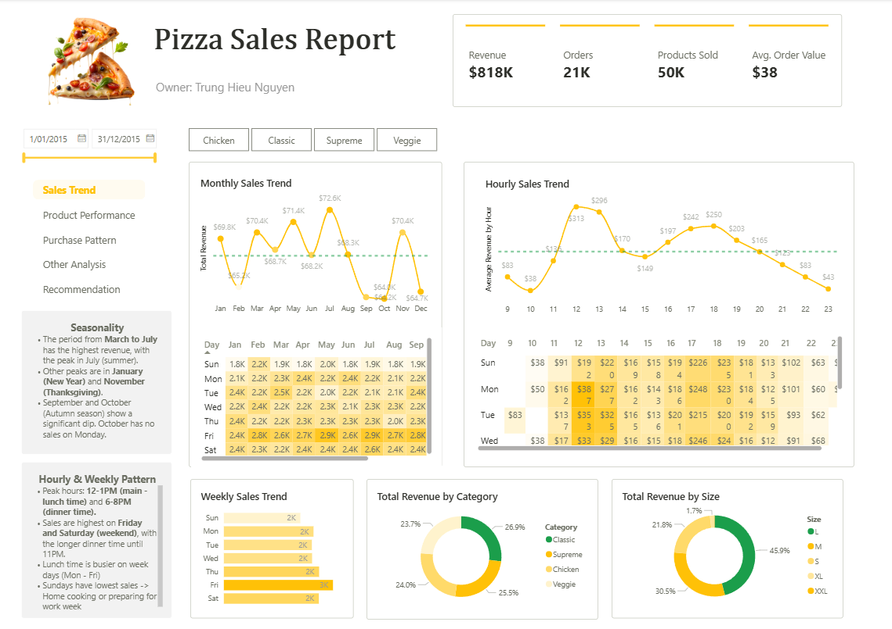
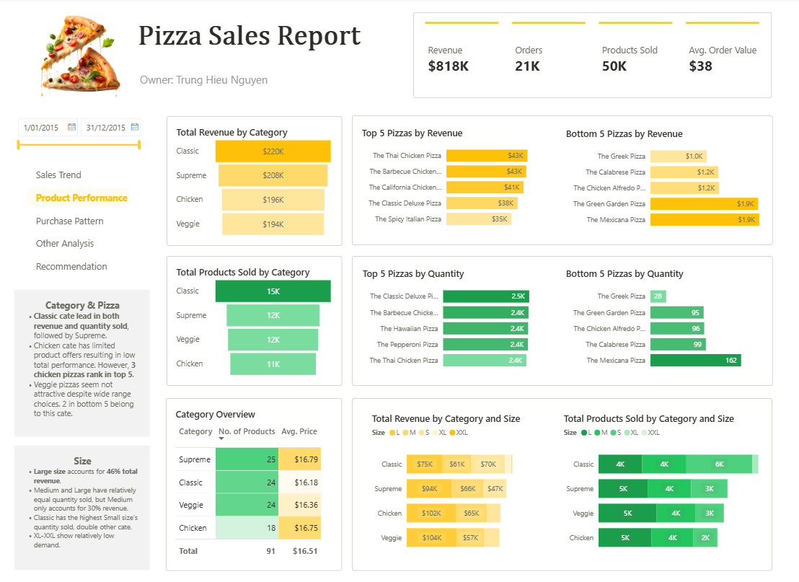
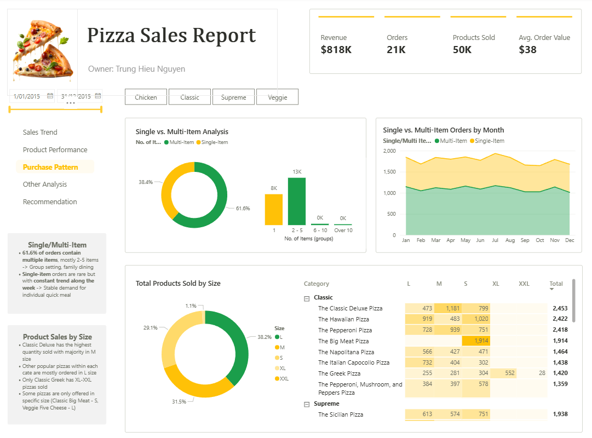
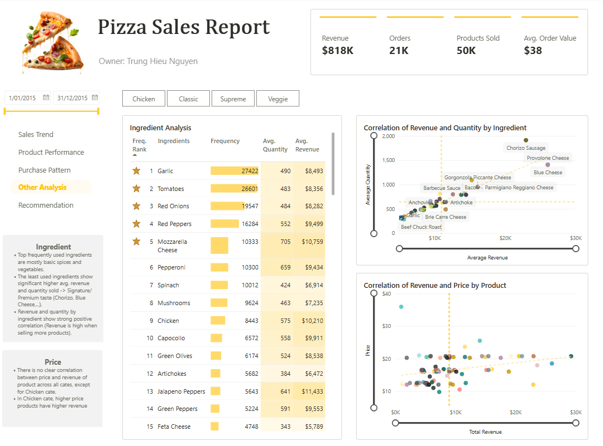

## 📖 Overview  
This project presents an **interactive Power BI dashboard** built to uncover key business insights for a **pizza manufacturing and distribution company**.  
By exploring transaction data, it reveals valuable insights into **sales trends**, **product performance**, **customer behavior**, and **ingredient usage**.  

The goal: to turn raw data into **actionable recommendations** that optimize operations, guide marketing decisions, and drive revenue growth.  

---

## 🎯 Objectives  
- Identify key sales and seasonal patterns.  
- Evaluate product and category performance.  
- Analyze customer purchasing behavior.  
- Examine ingredient usage for cost optimization.  
- Provide data-driven business recommendations.  

---

## 🧹 Data Cleaning & Preparation  
- Processed raw data using **Power Query** in Power BI.  
- Handled missing values, corrected data types, and standardized date/time formats.  
- Created a **star schema** connecting Orders, Pizzas, Customers, and Ingredients tables for efficient querying.  

---

## 📊 Analytical Modules  

### 1️⃣ Sales Trend Analysis  
- Tracked **daily, weekly, and monthly** revenue growth.  
- Detected **seasonal fluctuations** and **peak sales periods**.  
- Identified **low-performing time slots** to target with promotions.  

### 2️⃣ Product Performance  
- Ranked pizzas by **sales volume**, **revenue**, and **profit margin**.  
- Analyzed **pizza size** and **category** effects on sales (Classic, Veggie, Supreme, etc.).  
- Visualized category-level contributions to total revenue.  

### 3️⃣ Customer Purchase Behavior  
- Studied **order frequency**, **single vs. multi-item** trends, and **preferred sizes**.  
- Found that **large pizzas** and **multi-item orders** significantly boost revenue.  

### 4️⃣ Ingredient Analysis  
- Ranked **most and least used ingredients** across all pizzas.  
- Linked ingredient popularity with top-performing products.  
- Provided insights for **inventory planning** and **cost control**.  

---

## 💡 Key Insights & Business Recommendations  

### 🕓 Seasonal & Time-Based Promotions  
- Launch **summer specials** and **fall campaigns** to align with demand peaks.  
- Offer **weekday lunch deals** and **weekend family bundles**.  

### 🍽️ Product & Menu Optimization  
- Focus on **best-selling pizzas** and **high-margin products**.  
- Rework or remove **low-performing items**.  
- Highlight **large-size pizzas** and **premium ingredients** in marketing.  

### 👨‍👩‍👧‍👦 Customer Engagement  
- Introduce **combo deals** and **family meal bundles** to lift average order value.  
- Implement **loyalty or referral programs** for frequent customers.  

### 🥬 Ingredient & Inventory Efficiency  
- Optimize procurement for **high-demand ingredients**.  
- Adjust inventory management based on **seasonal sales patterns**.  

---

## 📈 Dashboard Highlights  

| Feature | Description |
|----------|-------------|
| **KPIs** | Total Revenue, Total Orders, Avg Order Value, Top-Selling Pizza |
| **Visuals** | Trend charts, heat maps, bar charts, category comparisons |
| **Interactivity** | Dynamic slicers by time, pizza size, and category |
| **Data Model** | Star schema for optimized performance |

> 💡 *Below is a sample dashboard preview

---

## 🛠️ Tools & Technologies  
- **Power BI** – Data visualization & dashboard design  
- **Power Query** – Data transformation & cleaning  
- **DAX** – KPI calculations and custom measures  
- **Excel/CSV** – Data source  
- **Star Schema Modeling** – Efficient data relationships  

---

## 🚀 Outcomes  
This project demonstrates how **data analytics** can turn raw transaction data into **strategic insights**.  
The dashboard supports decisions that:  
✅ Boost sales through optimized promotions  
✅ Improve profitability via better product focus  
✅ Reduce costs by managing ingredients efficiently  

---
## 📫 Contact  
👤 **Author:** Trung Hieu Nguyen  
📧 Email: hieutrungng2509@gmail.com
